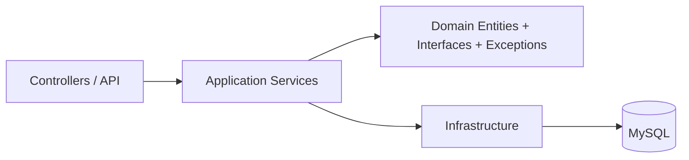

# EntreTodos API

[](https://dotnet.microsoft.com/)
[](https://learn.microsoft.com/ef/core/)
[](https://github.com/PomeloFoundation/Pomelo.EntityFrameworkCore.MySql)
[](https://aws.amazon.com/)

API REST para la gestión de gastos compartidos en viajes grupales, desarrollada en .NET con una arquitectura en capas inspirada en Clean Architecture. El proyecto fue adaptado para usar MySQL como motor de persistencia y se encuentra preparado para su despliegue en entornos de AWS.

## Descripción del proyecto

EntreTodos API permite a los usuarios:

- crear y administrar viajes;
- invitar participantes;
- registrar gastos compartidos;
- dividir gastos con distintos tipos de reglas;
- registrar pagos entre participantes;
- gestionar notificaciones básicas;
- autenticarse mediante AWS Cognito.

## Arquitectura

La solución sigue una estructura orientada a capas con responsabilidades separadas:



Esta estructura facilita la separación entre lógica de negocio, acceso a datos y exposición HTTP, lo que mejora el mantenimiento y la evolución del sistema.

## Tecnologías utilizadas

| Tecnología | Versión | Uso |
|---|---:|---|
| .NET | 10.0 | Runtime de la API |
| ASP.NET Core Web API | 10.0 | Exposición de endpoints REST |
| Entity Framework Core | 10.0.7 | ORM y manejo de datos |
| Pomelo EF Core MySql | 9.0.0 | Proveedor de EF Core para MySQL |
| MySQL | 8.x | Base de datos de producción y desarrollo |
| AWS Cognito | — | Proveedor de identidad (login y registro) |
| JWT Bearer | 8.18.0 | Validación de los tokens emitidos por Cognito |
| Swagger / OpenAPI | 10.1.7 | Documentación interactiva |

## Estructura del proyecto

```text
src/
├── Application/
│   ├── Interfaces/
│   ├── Models/
│   └── Services/
├── Domain/
│   ├── Entities/
│   ├── Enums/
│   ├── Exceptions/
│   └── Interfaces/
├── Infrastructure/
│   ├── Data/
│   └── Services/
└── Web/
    ├── Controllers/
    ├── Middlewares/
    └── Program.cs
```

## Patrones y decisiones de diseño

- Repository Pattern: encapsula el acceso a datos y evita acoplar la lógica de negocio al contexto de EF Core. Además, se implementa mediante un repositorio genérico que centraliza las operaciones comunes de lectura, escritura y consulta, facilitando la reutilización y manteniendo una estructura más consistente en la capa de infraestructura.
- Dependency Injection: los servicios y repositorios se resuelven desde el contenedor de ASP.NET Core.
- Middleware global de excepciones: centraliza el manejo de errores y devuelve respuestas HTTP consistentes.
- DTOs y modelos de request/response: separan la capa de presentación del dominio interno.
- Autenticación delegada en AWS Cognito: el login lo resuelve el frontend contra el User Pool y la API se limita a validar la firma del `id_token` contra el JWKS. La API no recibe contraseñas ni consulta el SDK de AWS.
- Rol propio del dominio: la autorización no se apoya en los grupos de Cognito sino en la columna `Rol` de la tabla `Usuarios`, de modo que un cambio de rol tiene efecto inmediato sin esperar a que el usuario renueve su token.
- Alta automática de usuarios (JIT provisioning): la primera vez que llega un token válido de alguien que todavía no está en la base, se le crea el registro local.

## Requisitos previos

- .NET SDK 10.0 o superior
- MySQL 8.x
- Visual Studio 2022 o VS Code con C# Dev Kit

## Instalación y configuración

### 1. Clonar el repositorio

```bash
git clone <url-del-repositorio>
cd Entre-Todos-API
```

### 2. Restaurar paquetes

```bash
dotnet restore
```

### 3. Configurar la cadena de conexión

La cadena de conexión **no está versionada**, porque contiene la contraseña de la base. Cada integrante define la suya como variable de entorno de usuario:

| Variable | Valor |
|---|---|
| `ConnectionStrings__DefaultConnection` | `server=localhost;port=3306;database=EntreTodosDB;user=root;password=TU_PASSWORD;` |

El doble guion bajo (`__`) es el separador de jerarquía que usa .NET para representar `ConnectionStrings:DefaultConnection` en una variable de entorno.

En Windows se puede cargar desde *Editar las variables de entorno del sistema → Variables de usuario*, o por PowerShell:

```powershell
[Environment]::SetEnvironmentVariable("ConnectionStrings__DefaultConnection", "server=localhost;port=3306;database=EntreTodosDB;user=root;password=TU_PASSWORD;", "User")
```

Hay que **reiniciar la terminal y el IDE** para que tomen la variable. Si falta, la API no arranca y muestra `Connection string 'DefaultConnection' no encontrada`.

### 4. Confiar el certificado de desarrollo

La API escucha en HTTPS (`https://localhost:7248`). Sin este paso el navegador bloquea las llamadas del frontend:

```bash
dotnet dev-certs https --trust
```

### 5. Ejecutar la API

```bash
dotnet run --project src/Web/Web.csproj
```

Queda disponible en `https://localhost:7248`, con Swagger en `/swagger/index.html`. Las migraciones pendientes se aplican solas al arrancar.

> **Importante para el frontend:** hay que apuntar a `https://localhost:7248`, no a `http://localhost:5101`. En desarrollo está activa la redirección a HTTPS, y el preflight de CORS (`OPTIONS`) sobre HTTP devuelve un `307` sin headers de CORS. Como los navegadores no siguen redirecciones en el preflight, la llamada falla con `Failed to fetch` sin llegar a la API.

## Autenticación

El login y el registro los resuelve **AWS Cognito** desde el frontend; la API no expone endpoints para eso. El frontend obtiene un `id_token` y lo envía en cada request:

```http
Authorization: Bearer <id_token>
```

Puntos a tener en cuenta al integrar un cliente:

- Hay que enviar el **`id_token`**, no el `access_token`. La API rechaza el segundo con un `401`, porque no incluye los claims `email` ni `name` que usa el alta automática de usuarios.
- Los orígenes habilitados para CORS se configuran en `Cors:AllowedOrigins`. En desarrollo ya viene cargado `http://localhost:5173`.
- La configuración del User Pool (`Cognito:Region`, `Cognito:UserPoolId`, `Cognito:ClientId`) sí está versionada: no son valores secretos, viajan igual en el bundle del frontend.

## Endpoints principales

Todos los endpoints requieren un `id_token` válido. Los marcados como *(Admin)* exigen además el rol correspondiente.

### Usuarios

- `GET /api/usuario/me` — perfil del usuario autenticado; lo crea si es la primera vez
- `GET /api/usuario` *(Admin)*
- `GET /api/usuario/{id}` *(Admin)*
- `PUT /api/usuario/{id}` — sólo el nombre; Admin, o el propio usuario
- `PATCH /api/usuario/{id}/rol` *(Admin)*
- `DELETE /api/usuario/{id}` — Admin, o el propio usuario

### Viajes

- `POST /api/viaje`
- `GET /api/viaje`
- `GET /api/viaje/{id}`
- `DELETE /api/viaje/{id}`

### Gastos

- `POST /api/gasto/igualitario`
- `POST /api/gasto/porcentaje`
- `POST /api/gasto/personalizado`
- `GET /api/gasto`
- `GET /api/gasto/{id}`
- `GET /api/gasto/viaje/{viajeId}`
- `PUT /api/gasto/{id}/igualitario`
- `PUT /api/gasto/{id}/porcentaje`
- `PUT /api/gasto/{id}/personalizado`
- `DELETE /api/gasto/{id}`

## Despliegue en AWS

El despliegue a Elastic Beanstalk está automatizado con GitHub Actions (`.github/workflows/deploy.yml`) y se dispara con cada push a `main`.

Los valores sensibles y los que dependen del entorno se cargan como *environment properties* de Elastic Beanstalk, nunca en el repositorio:

| Variable | Contenido |
|---|---|
| `ConnectionStrings__DefaultConnection` | Cadena de conexión a la base de producción |
| `Brevo__ApiKey` | API key del servicio de mails |
| `Cors__AllowedOrigins__0` | Origen del frontend productivo |
| `ASPNETCORE_ENVIRONMENT` | `Production` |

El índice numérico de `Cors__AllowedOrigins__0` corresponde a la posición dentro del arreglo; si hiciera falta habilitar más de un origen, se agregan `__1`, `__2`, etc.

## Estado del proyecto

Actualmente la API cuenta con:

- arquitectura en capas;
- autenticación delegada en AWS Cognito;
- manejo centralizado de excepciones;
- persistencia con EF Core y MySQL;
- despliegue orientado a entornos de producción.
- CI/CD con GitHub Action

## Mejoras futuras

- agregar pruebas unitarias e de integración;
- incorporar Docker;
- mejorar la cobertura de validaciones y reglas de negocio;
- ampliar la observabilidad en producción.

## Integrantes

- Agustín Reymundez
- Tobías Anfuso
- Felipe Sbuttoni
