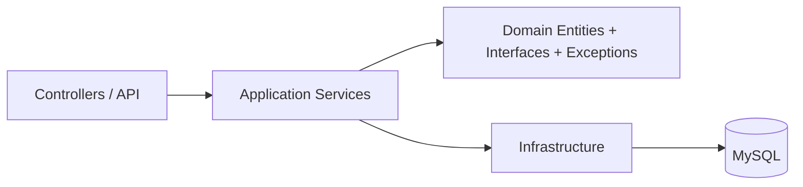

# EntreTodos API

[](https://dotnet.microsoft.com/)
[](https://learn.microsoft.com/ef/core/)
[](https://github.com/PomeloFoundation/Pomelo.EntityFrameworkCore.MySql)
[](https://aws.amazon.com/)

API REST para la gestión de gastos compartidos en viajes grupales, desarrollada en .NET con una arquitectura en capas inspirada en Clean Architecture. El proyecto fue adaptado para usar MySQL como motor de persistencia y se encuentra preparado para su despliegue en entornos de AWS.

## Descripción del proyecto

EntreTodos API permite a los usuarios:

- crear y administrar viajes;
- invitar participantes;
- registrar gastos compartidos;
- dividir gastos con distintos tipos de reglas;
- registrar pagos entre participantes;
- gestionar notificaciones básicas;
- autenticar usuarios mediante JWT.

## Arquitectura

La solución sigue una estructura orientada a capas con responsabilidades separadas:



Esta estructura facilita la separación entre lógica de negocio, acceso a datos y exposición HTTP, lo que mejora el mantenimiento y la evolución del sistema.

## Tecnologías utilizadas

| Tecnología | Versión | Uso |
|---|---:|---|
| .NET | 10.0 | Runtime de la API |
| ASP.NET Core Web API | 10.0 | Exposición de endpoints REST |
| Entity Framework Core | 10.0.7 | ORM y manejo de datos |
| Pomelo EF Core MySql | 9.0.0 | Proveedor de EF Core para MySQL |
| MySQL | 8.x | Base de datos de producción y desarrollo |
| JWT / Bearer | 8.18.0 | Autenticación y autorización |
| Swagger / OpenAPI | 10.1.7 | Documentación interactiva |

## Estructura del proyecto

```text
src/
├── Application/
│   ├── Interfaces/
│   ├── Models/
│   └── Services/
├── Domain/
│   ├── Entities/
│   ├── Enums/
│   ├── Exceptions/
│   └── Interfaces/
├── Infrastructure/
│   ├── Data/
│   └── Services/
└── Web/
    ├── Controllers/
    ├── Middlewares/
    └── Program.cs
```

## Patrones y decisiones de diseño

- Repository Pattern: encapsula el acceso a datos y evita acoplar la lógica de negocio al contexto de EF Core. Además, se implementa mediante un repositorio genérico que centraliza las operaciones comunes de lectura, escritura y consulta, facilitando la reutilización y manteniendo una estructura más consistente en la capa de infraestructura.
- Dependency Injection: los servicios y repositorios se resuelven desde el contenedor de ASP.NET Core.
- Middleware global de excepciones: centraliza el manejo de errores y devuelve respuestas HTTP consistentes.
- DTOs y modelos de request/response: separan la capa de presentación del dominio interno.
- Autenticación con JWT: protege los endpoints y permite diferenciar roles de usuario y administrador.

## Requisitos previos

- .NET SDK 10.0 o superior
- MySQL 8.x
- Visual Studio 2022 o VS Code con C# Dev Kit

## Instalación y configuración

### 1. Clonar el repositorio

```bash
git clone <url-del-repositorio>
cd Entre-Todos-API
```

### 2. Restaurar paquetes

```bash
dotnet restore
```

### 3. Configurar la base de datos

La API usa `ConnectionStrings:DefaultConnection` desde los archivos de configuración:

- `src/Web/appsettings.Development.json`
- `src/Web/appsettings.Production.json`

Ejemplo de conexión local:

```json
"ConnectionStrings": {
  "DefaultConnection": "server=localhost;port=3306;database=EntreTodosDB;user=root;password=;"
}
```

### 4. Ejecutar la API

```bash
dotnet run --project src/Web/Web.csproj
```

La API queda disponible en el puerto configurado por el entorno y expone Swagger/OpenAPI para explorar los endpoints.

## Endpoints principales

### Autenticación

- `POST /api/authentication/authenticate`

### Usuarios

- `POST /api/usuario`
- `GET /api/usuario`
- `GET /api/usuario/{id}`
- `PUT /api/usuario/{id}`
- `PATCH /api/usuario/{id}/rol`
- `DELETE /api/usuario/{id}`

### Viajes

- `POST /api/viaje`
- `GET /api/viaje`
- `GET /api/viaje/{id}`
- `DELETE /api/viaje/{id}`

### Gastos

- `POST /api/gasto/igualitario`
- `POST /api/gasto/porcentaje`
- `POST /api/gasto/personalizado`
- `GET /api/gasto`
- `GET /api/gasto/{id}`
- `GET /api/gasto/viaje/{viajeId}`
- `PUT /api/gasto/{id}/igualitario`
- `PUT /api/gasto/{id}/porcentaje`
- `PUT /api/gasto/{id}/personalizado`
- `DELETE /api/gasto/{id}`

## Despliegue en AWS

El proyecto está preparado para ejecutarse en un entorno de producción con configuración externa para la cadena de conexión y variables sensibles. En particular, la aplicación toma la conexión a MySQL desde `ConnectionStrings:DefaultConnection`, lo que permite desplegarla de forma sencilla en servicios como Elastic Beanstalk, EC2 o entornos containerizados en AWS.

## Estado del proyecto

Actualmente la API cuenta con:

- arquitectura en capas;
- autenticación JWT;
- manejo centralizado de excepciones;
- persistencia con EF Core y MySQL;
- despliegue orientado a entornos de producción.
- CI/CD con GitHub Action

## Mejoras futuras

- agregar pruebas unitarias e de integración;
- incorporar Docker;
- mejorar la cobertura de validaciones y reglas de negocio;
- ampliar la observabilidad en producción.

## Integrantes

- Agustín Reymundez
- Tobías Anfuso
- Felipe Sbuttoni
